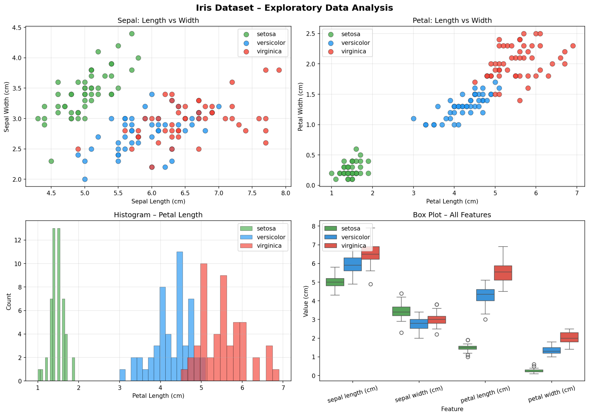
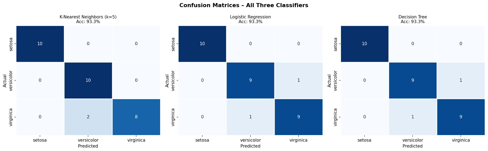

# Iris Flower Classification 🌸

## Overview
This project uses Machine Learning to classify Iris flowers into three species:
- Setosa
- Versicolor
- Virginica

Using flower measurements:
- Sepal Length
- Sepal Width
- Petal Length
- Petal Width

## Dataset
Built-in Iris dataset from Scikit-learn.

## Algorithms Used
- K-Nearest Neighbors (KNN)
- Logistic Regression
- Decision Tree

## Results
Best model accuracy achieved: **93.3%**

## Visual Outputs

### Exploratory Data Analysis


### Confusion Matrix


## Technologies Used
- Python
- Pandas
- NumPy
- Matplotlib
- Seaborn
- Scikit-learn

## How to Run

```bash
pip install -r requirements.txt
python iris.py
```

## Author
Ashlin Anna
